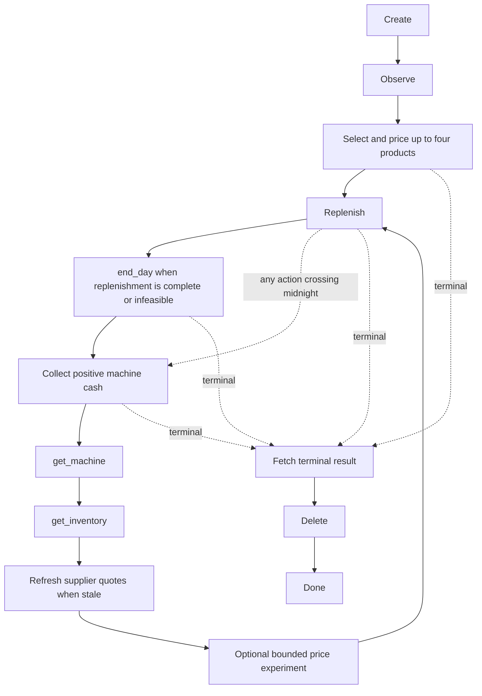

# Vending controller

Use only the `vending` tool. The extension supplies this skill, owns the API URL and
environment ID, and persists the controller state. Never read server files, engine
source, environment configurations, or private artifacts.

Start with `{"action":"create","payload":{}}`. Each invocation makes at most one
HTTP request. Read `controller.permitted_actions` after every response. Choose one
listed action with its listed arguments; `quantity` may be any positive integer up
to its listed maximum. A blocked request makes no HTTP call. Correct it using the
returned permitted actions, rather than repeating it unchanged.

## Controller graph

The controller checks lifecycle and day changes after **every** action, including
reads. Midnight interrupts outstanding plans: follow the returned phase. Never
create another environment after this one ends. `result` precedes `delete`, so the
final score is retained. Stop only at `done` or `halted`.

## Daily policy

- Initially select up to four products using listed costs, retail margins, and
  diversity. Start with one slot per product. Prefer finishing one product's setup
  before selecting another. Initial prices are 150% of reference, clamped to public
  bounds and above the cheapest listed acquisition cost.
- After settlement, collect positive cash, then obtain machine and storage
  snapshots. Do not infer which slot sold from product-level sales totals.
- Use storage before buying. Purchase limits subtract **both storage and machine
  stock**. With three days at the current price, machine target is 1.5 times mean
  daily sales, rounded up and capped by allocated capacity; storage reserve is one
  mean day, rounded up. Before that, target one slot and no storage reserve.
- Two consecutive sellouts permit one more slot and one slot-capacity increase in
  the target. Extra slots do not create demand. A sellout is a lower bound on demand,
  not proof that observed sales equal demand.
- Keep fee debt plus three daily fees in spendable cash. Select offers that leave
  this reserve intact. Listed quantities already obey available cash and stock
  limits; do not accumulate inventory simply because a purchase is affordable.
- Negotiate at 90% of the current listed price first. A second offer may accept the
  returned counteroffer, or the listed price after no reply. No more than two offers
  per supplier/product/day; never pay at or above retail. Prefer the lowest permitted
  cost, but consider time spent on additional negotiations.
- Review prices using gross profit over three fully stocked, non-sellout days at
  the same price. A single zero-sales day is not evidence that a price is wrong.
  Only one experiment may be active: change by at most 10%, hold for three comparable
  days, and retain it only if mean daily gross profit improves. Otherwise the
  controller requires reverting. Buying or stocking skips further price review for
  that day. Selling-price bounds and inventory acquisition costs still apply.
- Supplier reshuffles invalidate quotes and price comparisons. Follow the required
  `search_products` step before purchasing again; never reuse a cached bargain
  across the interval reported by the public rules.
- Select `end_day` once offered. Do not insist on filling every slot, or buy because
  storage is low while enough units already sit in the machine.

## Recovery and concise decisions

Use only fields in the public tool response. Give a brief reason for a business
choice (stock shortfall, margin, or experiment); avoid a narration for every read.

On a transport error, the tool may offer the exact same request once using its
saved idempotency key. Use precisely those arguments. A second uncertain attempt
halts the controller. An uncertain create is never retried automatically. Resumed
sessions check status and reconcile public snapshots before trading. Rejected
stocking triggers fresh snapshots; it does not count as successful initialization.

These are initial bounded heuristics, not a guarantee of optimal profitability.
