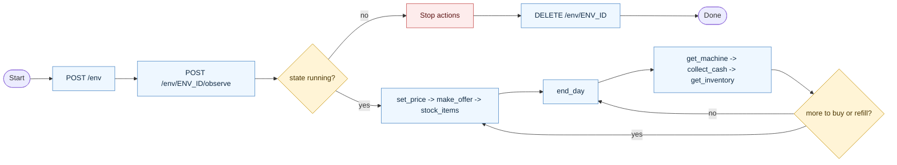

# Simplified vending-machine REST API

Use only HTTP requests to `${VENDING_API_URL:-http://127.0.0.1:8000}`.

Hard rules:

1. Use only `bash` with `curl --fail-with-body -sS` and JSON bodies.
2. Run one API request per `bash` tool call.
3. Never read server files, engine source, environment JSON, or private artifacts.
4. Never start the server or invoke project scripts from this skill.
5. `ENV_ID` is a placeholder. Never send literal `ENV_ID` in a request.
6. On graph-guard block, do the prerequisite named in the block reason.

Required lifecycle:

Lifecycle endpoints are `POST /env`, `GET /env/ENV_ID/status`, and `DELETE /env/ENV_ID`.

1. First call must be `POST /env`.
2. Save returned `env_id` exactly, including `env_` prefix.
3. Call `POST /env/ENV_ID/observe` with an empty JSON body `{}` immediately after creation.
4. Operate only while status is `running`.
5. On `ended` or `unavailable`, stop action calls and `DELETE /env/ENV_ID`.

Use this create call:

```bash
curl --fail-with-body -sS -X POST "${VENDING_API_URL:-http://127.0.0.1:8000}/env" \
  -H 'Content-Type: application/json' -d '{}'
```

To select a saved definition, create with `{"environment_name":"NAME"}`.

## Controller graph

Follow this finite-state controller. Prefer one action per decision.



  ## Daily policy

  1. `observe` once at startup, then cache `result.rules`, slots, products, suppliers, balances.
  1. `observe` means `POST /env/ENV_ID/observe`; keep the full `env_...` id unchanged.
  1. `observe` uses `{}` only; do not send pricing or product fields to it.
  2. Choose up to four products with best listed cost relative to reference price.
  3. For each selected product: `set_price` -> accepted `make_offer` -> `stock_items`.
  4. Use `end_day` to advance to settlement; avoid repeated `wait` before first settlement.
  5. After midnight: `get_machine`, `collect_cash` if positive, then `get_inventory`.
  6. Refill depleted slots; if storage is short, buy missing quantity first.
  7. Never repeat rejected `stock_items` unchanged.

| Action | Preconditions | On refusal/error, do this next |
| --- | --- | --- |
| `observe` | Have valid `env_id`; state is `running`. | If not running, stop and delete. |
| `set_price` | Product exists; `unit_price_cents` within `[min_price_cents, max_price_cents]`. | Clamp to valid bounds and retry once with corrected value. |
| `make_offer` | Supplier/product exist; quantity is positive and within cap; enough spendable cash for `quantity * unit_price_cents`. | If `insufficient_funds`, reduce quantity or choose cheaper product/quote. If countered, accept only if profitable. |
| `stock_items` | Product price already set; slot exists; slot empty or same product; quantity fits slot and storage. | If `price_required`, call `set_price`. If `insufficient_stock`, buy missing quantity first. If `slot_full`, choose another valid slot or wait for sales. |
| `unstock_items` | Slot exists and contains at least requested quantity. | Re-read machine state and lower quantity to available amount. |
| `collect_cash` | Machine cash is positive. | Skip when zero; continue daily loop. |
| `end_day` | Initial assortment is stocked or restock attempt completed. | If not ready, finish stocking first. |

| Action | JSON body | Purpose |
| --- | --- | --- |
| `observe` | `{}` | Full public snapshot: catalog, supplier quotes, inventory, slots, prices, balances, and rules. |
| `search_products` | `{}` or `{"product_id":"p01"}` | Find public products, suppliers, and quotes. |
| `get_inventory` | `{}` | Current storage inventory. |
| `get_balance` | `{}` | Spendable cash, machine cash, and fee debt. |
| `get_machine` | `{}` | Slot IDs, contents, and capacities. |
| `make_offer` | `{"supplier_id":"s01","product_id":"p01","quantity":10,"unit_price_cents":100}` | Purchase stock. Only `accepted` delivers immediately. |
| `set_price` | `{"product_id":"p01","unit_price_cents":150}` | Set retail price within public bounds. Set a price before stocking that product. |
| `stock_items` | `{"slot_id":"r1s1","product_id":"p01","quantity":10}` | Move purchased storage stock into a machine slot. |
| `unstock_items` | `{"slot_id":"r1s1","quantity":10}` | Move items from a slot back to storage. |
| `collect_cash` | `{}` | Move machine cash into spendable cash. |
| `wait` | `{}` | Advance simulated time by the configured wait duration; sales settle at midnight. |
| `end_day` | `{}` | Advance to the next midnight, settle daily sales, and assess fees. |

Validation notes:

1. Money is integer cents.
2. Quantities are positive integers.
3. Use only known IDs from `observe` or filtered `search_products`.
4. Unknown fields or invalid ids/values return 422; invalid JSON returns 400.
